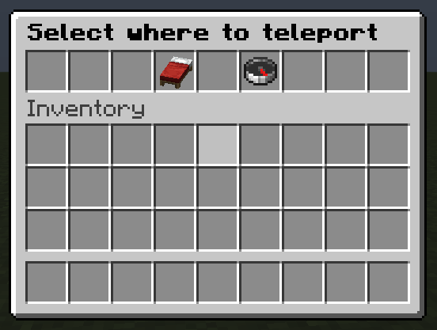
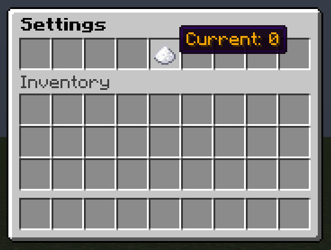
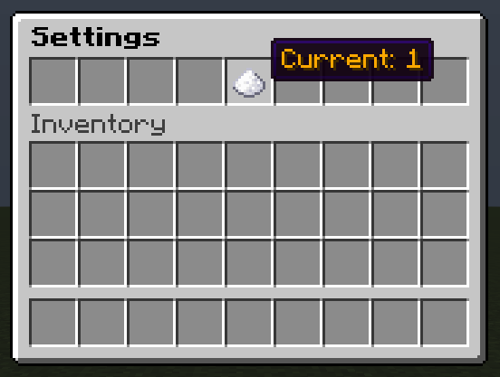
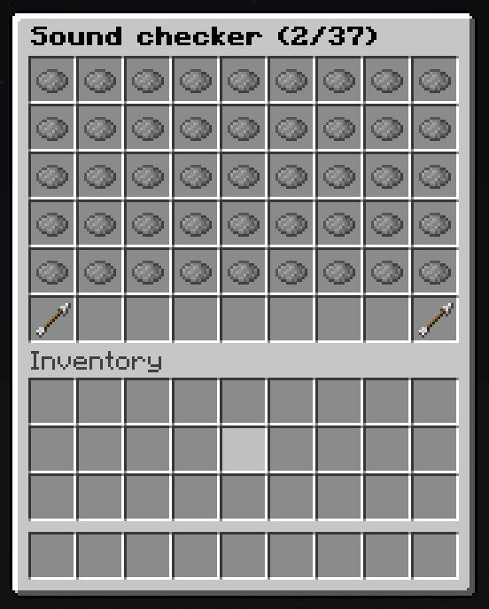

# ktInventory

[](http://www.apache.org/licenses/LICENSE-2.0)
[](https://search.maven.org/artifact/dev.s7a/ktInventory)
[](https://gh.s7a.dev/ktInventory)
[](.github/workflows/build.yml)

Spigot library with Kotlin for easy inventory creation and event handling

## Installation

### build.gradle.kts

```kotlin
repositories {
    mavenCentral()
}

dependencies {
    implementation("dev.s7a:ktInventory:2.2.0")
}
```

## Usage

Upgrading from v2.1.1 with a custom `KtInventoryPluginContext` implementation requires
adding `handlerId` and recompiling. See the [v2.2.0 migration guide](DEPRECATION.md#required-migration-in-v220).

These examples are included in the [example plugin](example/src/main/kotlin/dev/s7a/ktinventory/example/ExamplePlugin.kt) and shown
on Paper 1.21.4. They use the small [`itemStack` helper](example/src/main/kotlin/dev/s7a/ktinventory/example/ItemStack.kt) to set
item display names with `&` color codes. In the opening calls, `plugin` is your `Plugin`
instance and `player` is the `Player` to show the inventory to. The complete source links
include the imports.

### Basic menu

Place named buttons in a single row and handle clicks. The bed teleports the player to
an existing bed spawn; the compass teleports them to the world spawn. Both close the menu.



```kotlin
class SimpleMenu(
    context: KtInventoryPluginContext,
) : KtInventory(context, 1) {
    constructor(plugin: Plugin) : this(KtInventoryPluginContext(plugin))

    override fun title() = "&0&lSelect where to teleport"

    init {
        button(3, itemStack(Material.RED_BED, "&cRespawn")) { event ->
            val player = event.player as? Player ?: return@button
            val respawnLocation = player.bedSpawnLocation
            if (respawnLocation != null) {
                player.teleport(respawnLocation)
            } else {
                player.sendMessage("Not found bedSpawnLocation")
            }
            player.closeInventory()
        }
        button(5, itemStack(Material.COMPASS, "&bWorldSpawn")) { event ->
            val player = event.player as? Player ?: return@button
            player.teleport(player.world.spawnLocation)
            player.closeInventory()
        }
    }
}
```

Open it with `SimpleMenu(plugin).open(player)`.

[Complete source: SimpleMenu.kt](example/src/main/kotlin/dev/s7a/ktinventory/example/menu/SimpleMenu.kt)

### Updating settings

Keep a shared counter and rebuild open settings menus with `refreshAll()` after a click.
Left-click the sugar to increment it; right-click to decrement it. Hover over it to see
the current value in its display name.

| Before | After one left-click |
| --- | --- |
|  |  |

```kotlin
class SettingsInventory(
    val context: KtInventoryPluginContext,
) : KtInventory(context, 1) {
    constructor(plugin: Plugin) : this(KtInventoryPluginContext(plugin))

    override fun title() = "&0&lSettings"

    init {
        button(4, itemStack(Material.SUGAR, displayName = "&6Current: $count")) {
            if (it.click.isLeftClick) {
                count += 1
            } else {
                count -= 1
            }
            refreshAll()
        }
    }

    companion object : Refreshable<SettingsInventory>(SettingsInventory::class) {
        private var count = 0

        override fun createNew(
            player: HumanEntity,
            inventory: SettingsInventory,
        ) = SettingsInventory(inventory.context)
    }
}
```

Open it with `SettingsInventory(plugin).open(player)`.

[Complete source: SettingsInventory.kt](example/src/main/kotlin/dev/s7a/ktinventory/example/settings/SettingsInventory.kt)

### Paginated list

Turn the sound registry into clickable entries, show 45 entries per page, and reserve
the bottom row for navigation. Clicking an entry plays that sound to the player;
the arrows move between pages.



```kotlin
class SoundCheckInventory(
    context: KtInventoryPluginContext,
) : KtInventoryPaginated(context, 6) {
    constructor(plugin: Plugin) : this(KtInventoryPluginContext(plugin))

    override val entries =
        Registry.SOUNDS.map { sound ->
            createButton(
                itemStack(Material.GRAY_DYE, "&6${sound.key.key}"),
            ) { event ->
                val player = event.player as? Player ?: return@createButton
                player.playSound(player.location, sound, 1F, 1F)
            }
        }

    override fun title(
        page: Int,
        lastPage: Int,
    ): String = "&0&lSound checker (${page + 1}/${lastPage + 1})"

    init {
        paginateSlot(0 until 45)
        previousPageButton(45, itemStack(Material.ARROW, "&d<<"))
        nextPageButton(53, itemStack(Material.ARROW, "&d>>"))
    }
}
```

Open it with `SoundCheckInventory(plugin).open(player)`.

[Complete source: SoundCheckInventory.kt](example/src/main/kotlin/dev/s7a/ktinventory/example/soundchecker/SoundCheckInventory.kt)

For Adventure titles and choosing a pagination model, see [Inventory variants](docs/inventories.md).

## Documentation

- [Inventory variants](docs/inventories.md): Paper titles and choosing a pagination model.
- [API reference](https://gh.s7a.dev/ktInventory): classes and method contracts.
- [Migration and deprecations](DEPRECATION.md): required upgrade actions.
- [Changelog](CHANGELOG.md): changes between releases.

## Skill

The [ktInventory skill](skills/ktinventory/SKILL.md) provides usage guidance for AI agents. Install it with either command:

```sh
gh skill install sya-ri/ktInventory skills/ktinventory
# Alternative:
npx skills add sya-ri/ktInventory --skill ktinventory
```
